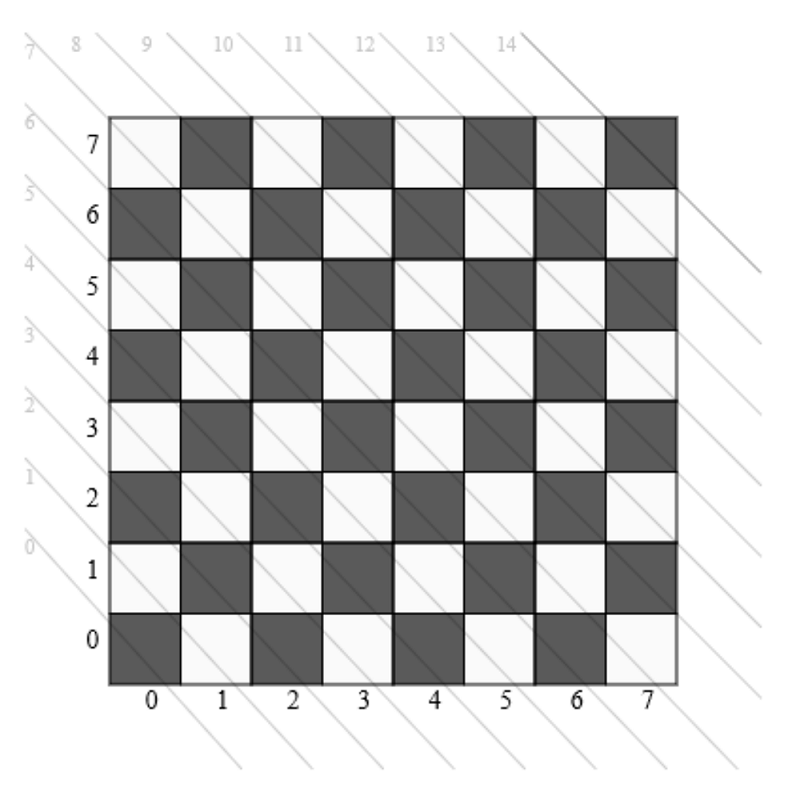

# Welcome to the queen algorithm design

[**The basic algorithm**](#the-basic-algorithm)  
[**A simple recursive function approach**](#a-simple-recursice-function-approach)  
[**Improved functional approch**](#improved-functional-approach)  
[**The locking approach**](#the-locking-approach)  
[**Multiprocessing**](#multiprocessing)  
[**Find one solution only**](#find-one-solution-only)  
[**Some Links**](#some-links)  

## The basic algortihm

On a chessboard dimension `n x n` you should be able to place `n` queens
that way that no queen does threaten another queen. For a `8 x 8` chessboard
you will find `92` solutions. With an increasing size of the chessboard
the number of solutions increases significantly.

## A simple recursive function approach

The complete code you find in [queen1.py](queen1.py). The output
looks like this:

```
Queen raster (11x11)
...took 1.708056 seconds.
...2680 solutions found.
...one solution: [(1, 1), (3, 2), (5, 3), (7, 4), (9, 5), (11, 6), (2, 7), (4, 8), (6, 9), (8, 10), (10, 11)]
```

Also it does work fine there are some disadvantages with this approach:

* With a growing number of found valid queen locations the validation takes longer.
* The whole current solution is copied for each function call
* Each function call require all information passed; looking at the objectoriented approach `row` is the only parameter you need.
* On each recursion level we have a loop for all columns also the number of available columns decrease.

```python
def queen(width, row=1, solution=[], solutions=[]):
    for column in range(1, width+1):
        found = False
        # validation:
        for scolumn, srow in solution:
            if scolumn == column:
                found = True
                break
            if abs(scolumn - column) == abs(srow-row):
                found = True
                break

        if found:
            continue

        if row == width:
            solutions.append(solution + [(column, row)])
        else:
            queen(width, row+1, solution + [(column, row)], solutions)
```

## Improved functional approach

The complete code you find in [queen2.py](queen2.py). The output
looks like this:

```
Queen raster (11x11)
...took 0.693340 seconds.
...2680 solutions found.
...one solution: [(1, 1), (3, 2), (5, 3), (7, 4), (9, 5), (11, 6), (2, 7), (4, 8), (6, 9), (8, 10), (10, 11)]
```

As you can see the algorithm is at least two times faster. Following changes:

* Using the closure principle we can keep the two variables `width` and `solutions` global and so we don't need to pass them each function call.
* We now pass the list of available columns which reduce each recursion so we don't have to check for occupied columns anymore.

```python
def queen(width, solutions=[]):
    def run(row=1, solution=[], columns=[]):
        for column in columns:
            found = False
            # validation:
            for scolumn, srow in solution:
                if abs(scolumn - column) == abs(srow-row):
                    found = True
                    break

            if found:
                continue

            if row == width:
                solutions.append(solution + [(column, row)])
            else:
                run(row+1, solution + [(column, row)],
                    [x for x in columns if not x == column])
    run(row=1, solution=[], columns=range(1, width+1))
```

## The locking approach



As you can see a chessboard has two kind of diagonals each with
`n x 2 - 1` diagonals. For better visualization I've shown the diagonals
only from top/left to bottom/right. You easily can verify that the sum
of one row and one column is the value of the diagonal; The calculation
of the diagonals which from bottom/left to top/right is
 `last Row index - row + column`. Some examples in next table:

| column   | row | top/left - bottom/right | bottom/left - top/right |
| -------- | --- | ----------------------- | ----------------------- |
| 3        | 5   | 3 + 5 = 8               | 7 - 5 + 3 =  5          |
| 6        | 2   | 6 + 2 = 8               | 7 - 2 + 6 = 11          |
| 0        | 2   | 0 + 2 = 2               | 7 - 2 + 0 =  5          |

This lead us to an improved algorithm.
The complete code you find in [queen3.py](queen3.py). The output
looks like this:

```bash
Queen raster (11x11)
...took 0.248641 seconds.
...2680 solutions found.
...one solution: (1, 1),(2, 7),(3, 2),(4, 8),(5, 3),(6, 9),(7, 4),(8, 10),(9, 5),(10, 11),(11, 6)
```

```python
def queen(width, solutions=[]):
    lastRow = width - 1
    columns = [-1] * width
    diagonals1 = [0] * (width * 2 - 1)
    diagonals2 = [0] * (width * 2 - 1)

    def run(row, available_columns=[]):
        for column in available_columns:
            ixDiag1 = row + column
            if diagonals1[ixDiag1] == 1:
                continue

            ixDiag2 = lastRow - row + column
            if diagonals2[ixDiag2] == 1:
                continue

            columns[column] = row

            if row == lastRow:
                solutions.append(columns[:])
            else:
                diagonals1[ixDiag1] = 1
                diagonals2[ixDiag2] = 1
                run(row+1, [x for x in available_columns if not x == column])
                diagonals1[ixDiag1] = 0
                diagonals2[ixDiag2] = 0

            columns[column] = -1

    run(row=0, available_columns=range(width))
```

As you can see it's faster as the previous (a bit more than the factor 2).
The queen algorithm you see in `src` bases on this.

## Multiprocessing

I experienced when using the threading library of 
Python is mostly gets slower. However the Multiprocessing
library is really interesting. I've been taken the 
first algorithm on this page enabling that one for
multiprocessing and here the result:

```
Queen raster (11x11)
...took 0.920143 seconds.
...2680 solutions found.
...one solution: [(1, 1), (3, 2), (5, 3), (7, 4), (9, 5), (11, 6), (2, 7), (4, 8), (6, 9), (8, 10), (10, 11)]
```

That's a factor of 2 faster. The cpu count is 8 and you 
can see in the resource monitor that all cpu's are used.

The algorithm changes like you see next. The worker will
get the width and a column taking this one and first row
as first queen postion.

```python
def worker(data):
    width, column = data
    solutions = []
    queen(width, 2, [(column, 1)], solutions)
    return solutions
```

The execution of the whole algorithm works
like following:

```python
solutions = []
with closing(multiprocessing.Pool(multiprocessing.cpu_count())) as pool:
    for solution in pool.map(worker, [(width, column) for column in range(1, width+1)]):
        solutions.extend(solution)
    pool.terminate()
```

The complete code you find in [queen4.py](queen4.py)
Also pypy is able to run that code again a factor 2 faster.

The multiprocessing applied to Queen.py in src folder
saved as Queen_multiprocessing.py:

```
Running /docker/src/Queen_multiprocessing.py with /opt/rh/rh-python35/root/usr/bin/python - version 3.5.1 (default, Oct 21 2016, 21:37:19) 
[GCC 4.8.5 20150623 (Red Hat 4.8.5-4)]
Queen raster (14x14)
...took 9.640661 seconds.
...365596 solutions found.
```

The average time for single threaded is approximately 29 seconds so 
we have nearly factor 3 as improvement. With this I can run the algortihm
now for 15x15 which results in 54 seconds. 16x16 still unreachable
by given limit of 2 minutes but a great improvement.

On pypy the multiprocessing seems not to having any effect;
with an older version it's significant slower than the
single threaded version.


## Find one solution only

Latests when you start to find one solution only per chessboard size then
you will see how dramatically time increases. The memory is now not 
a problem anymore which forced swapping of system resource after a while.
There are too many false tries until the algorithm does reach the last 
row. Here the duration in seconds:

| Chessboard size | Duration  |
| ---             | ---       |
| 8 x 8 - 12 x 12 |   0.00000 |
| 13 x 13         |   0.00400 |
| 14 x 14         |   0.00800 |
| 15 x 15         |   0.01200 |
| 16 x 16         |   0.04800 |
| 17 x 17         |   0.04000 |
| 18 x 18         |   0.14800 |
| 19 x 19         |   0.09203 |
| 20 x 20         |   1.10800 |
| 21 x 21         |   0.42000 |
| 22 x 22         |   9.28803 |
| 23 x 23         |   3.13599 |
| 24 x 24         |   8.27200 |
| 25 x 25         |  11.68800 |
| 26 x 26         |  20.74800 |
| 27 x 27         |  34.72400 |
| 28 x 28         |  53.75600 |
| 29 x 29         | 587.69042 |
| 30 x 30         | 942.39768 |

The complete code you find in [Queen_one_solution.py](Queen_one_solution.py).
The results are written into a `one_solution.json`. Of course with C++ we 
can be much faster but Python was the start of this project and for
analyzing purpose sufficient.

One last change I did was to shuffle the columns. In worst cast the performance would 
be same as you see in table above but also following results are possible:

| Chessboard size | Duration  |
| ---             | ---       |
| 26 x 26         |  4.46992  |
| 27 x 27         |  2.24099  |
| 28 x 28         |  3.42310  |
| 29 x 29         | 16.62023  |
| 30 x 30         | 12.36789  |

Now one further improvement would be possible: the algorithm could measure the
time and reaching a time limit it could stop restarting again until a solution
is found. The idea is to avoid - if possible - to be forced to wait several
minutes. The difference between 12 and 942 let me think this approach could work.
Instead of time - eventually - it might make sense to analyse the steps depending
on the board resolution; it could be that also this is a limit that can be taken
unless the random mode finds the optimal path.

## Some links

* http://www.jsomers.com/nqueen_demo/nqueens.html
* https://sites.google.com/site/nqueensolver/
* ...
